#ABSA-Pytorch

> Aspect Based Sentiment Analysis, PyTorch Implementations.
>
> 使用PyTorch实现ABSA的各项任务，经典模型与最新模型。
>
> 参考：
> https://github.com/songyouwei/ABSA-PyTorch

#Non-Bert-based models
##ATE/AE
###DE-CNN([de_cnn.py])(./models/AE/DE_CNN.py)
Hu Xu, Bing Liu, Lei Shu, Philip S. Yu. "Double Embeddings and CNN-based Sequence Labeling for Aspect Extraction."Proceedings of the 56th Annual Meeting of the Association for Computational Linguistics (Volume 2: Short Papers).2018.[[pdf]](https://www.aclweb.org/anthology/P18-2094.pdf)

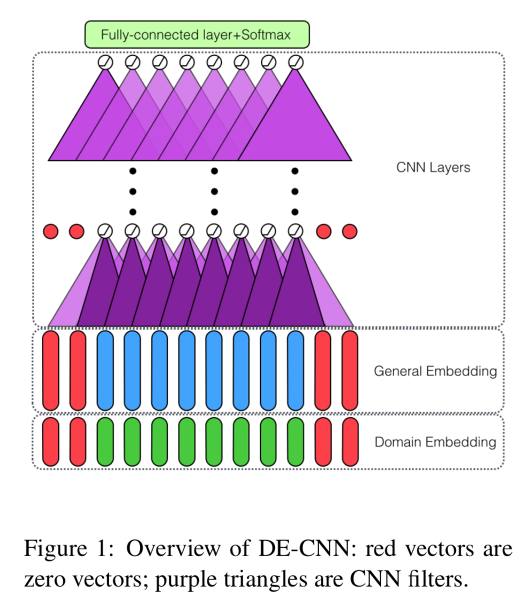
##ASC/AS
### MGAN ([mgan.py](./models/AS/mgan.py))
Fan, Feifan, et al. "Multi-grained Attention Network for Aspect-Level Sentiment Classification." Proceedings of the 2018 Conference on Empirical Methods in Natural Language Processing. 2018. [[pdf]](http://aclweb.org/anthology/D18-1380)

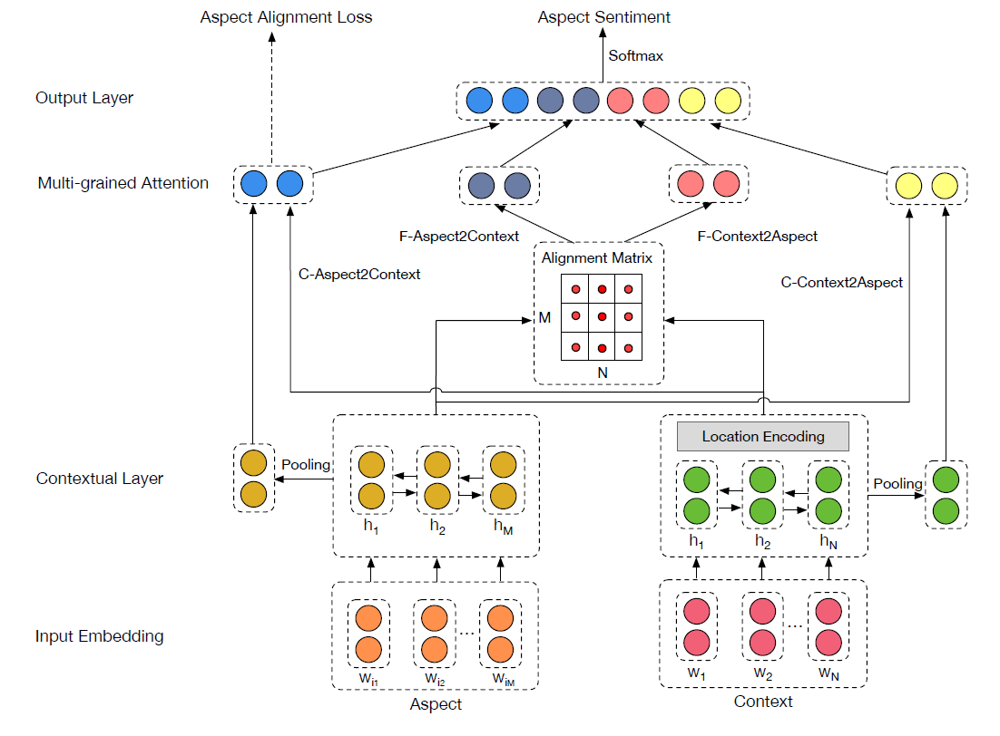

### AOA ([aoa.py](./models/aoa.py))
Huang, Binxuan, et al. "Aspect Level Sentiment Classification with Attention-over-Attention Neural Networks." arXiv preprint arXiv:1804.06536 (2018). [[pdf]](https://arxiv.org/pdf/1804.06536.pdf)

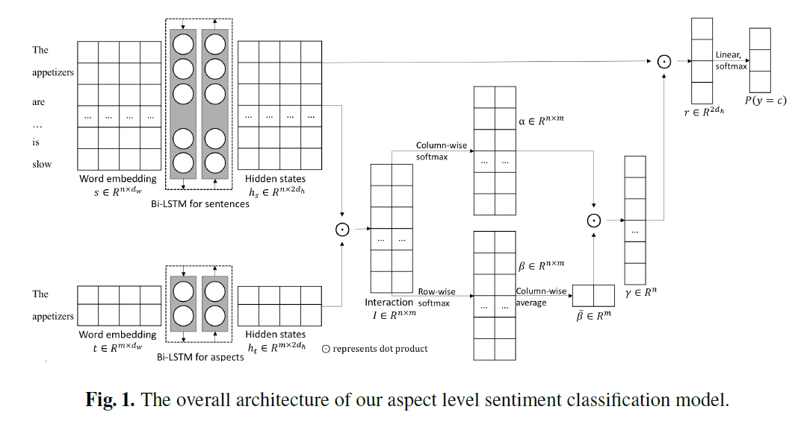

### TNet ([tnet_lf.py](./models/tnet_lf.py))
Li, Xin, et al. "Transformation Networks for Target-Oriented Sentiment Classification." arXiv preprint arXiv:1805.01086 (2018). [[pdf]](https://arxiv.org/pdf/1805.01086)

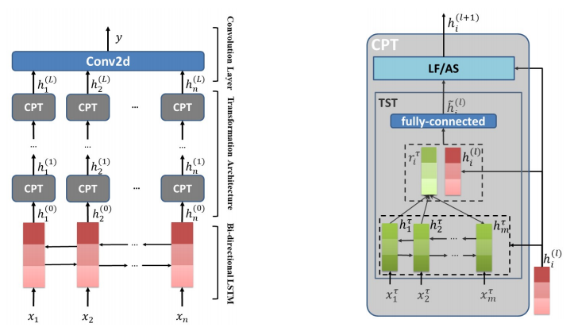

### Cabasc ([cabasc.py](./models/cabasc.py))
Liu, Qiao, et al. "Content Attention Model for Aspect Based Sentiment Analysis." Proceedings of the 2018 World Wide Web Conference on World Wide Web. International World Wide Web Conferences Steering Committee, 2018.

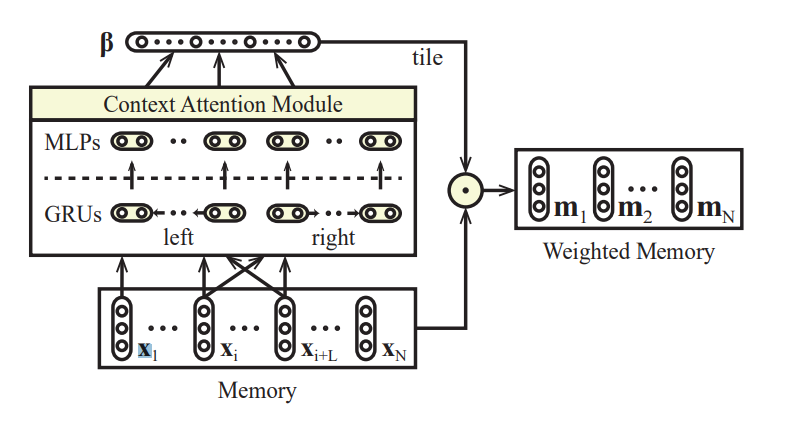

### RAM ([ram.py](./models/ram.py))
Chen, Peng, et al. "Recurrent Attention Network on Memory for Aspect Sentiment Analysis." Proceedings of the 2017 Conference on Empirical Methods in Natural Language Processing. 2017. [[pdf]](http://www.aclweb.org/anthology/D17-1047)

### MemNet ([memnet.py](./models/memnet.py))
Tang, Duyu, B. Qin, and T. Liu. "Aspect Level Sentiment Classification with Deep Memory Network." Conference on Empirical Methods in Natural Language Processing 2016:214-224. [[pdf]](https://arxiv.org/pdf/1605.08900)

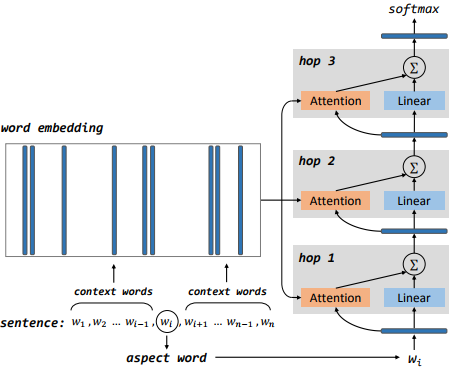

### IAN ([ian.py](./models/ian.py))
Ma, Dehong, et al. "Interactive Attention Networks for Aspect-Level Sentiment Classification." arXiv preprint arXiv:1709.00893 (2017). [[pdf]](https://arxiv.org/pdf/1709.00893)

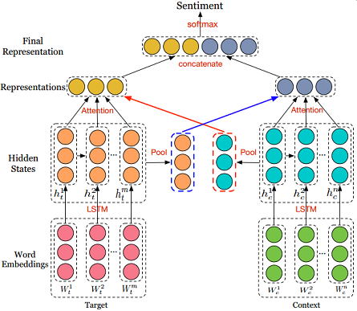

### ATAE-LSTM ([atae_lstm.py](./models/atae_lstm.py))
Wang, Yequan, Minlie Huang, and Li Zhao. "Attention-based lstm for aspect-level sentiment classification." Proceedings of the 2016 conference on empirical methods in natural language processing. 2016.

### TD-LSTM ([td_lstm.py](./models/td_lstm.py))

Tang, Duyu, et al. "Effective LSTMs for Target-Dependent Sentiment Classification." Proceedings of COLING 2016, the 26th International Conference on Computational Linguistics: Technical Papers. 2016. [[pdf]](https://arxiv.org/pdf/1512.01100)

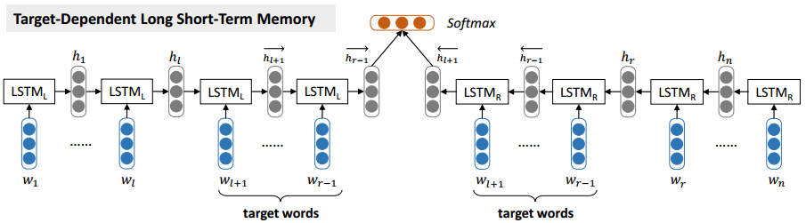

### LSTM ([lstm.py](./models/lstm.py))

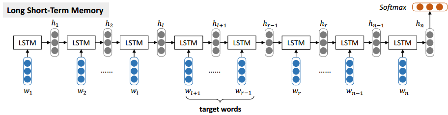

##AE&AS 
###DOER([doer.py])(./models/AE_AS/doer.py)

Huaishao Luo, Tianrui Li, Bing Liu, Junbo Zhang."DOER: Dual Cross-Shared RNN for Aspect Term-Polarity Co-Extraction."Proceedings of the 57th Annual Meeting of the Association for Computational Linguistics.2019.[[pdf]](https://www.aclweb.org/anthology/P19-1056.pdf)

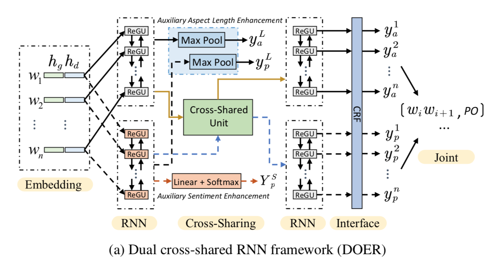
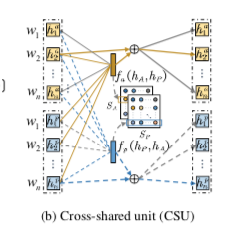

###IMN([IMN.py])(./models/AE_AS/IMN.py)

Ruidan He, Wee Sun Lee, Hwee Tou Ng, and Daniel Dahlmeier."An Interactive Multi-Task Learning Network for End-to-End Aspect-Based Sentiment Analysis."Proceedings of the 57th Annual Meeting of the Association for Computational Linguistics.2019.[[pdf]](https://www.aclweb.org/anthology/P19-1056.pdf)

##Bert-based models

### LCF-BERT ([lcf_bert.py](./models/lcf_bert.py))
Zeng Biqing, Yang Heng, et al. "LCF: A Local Context Focus Mechanism for Aspect-Based Sentiment Classification." Applied Sciences. 2019, 9, 3389. [[pdf]](https://www.mdpi.com/2076-3417/9/16/3389/pdf)

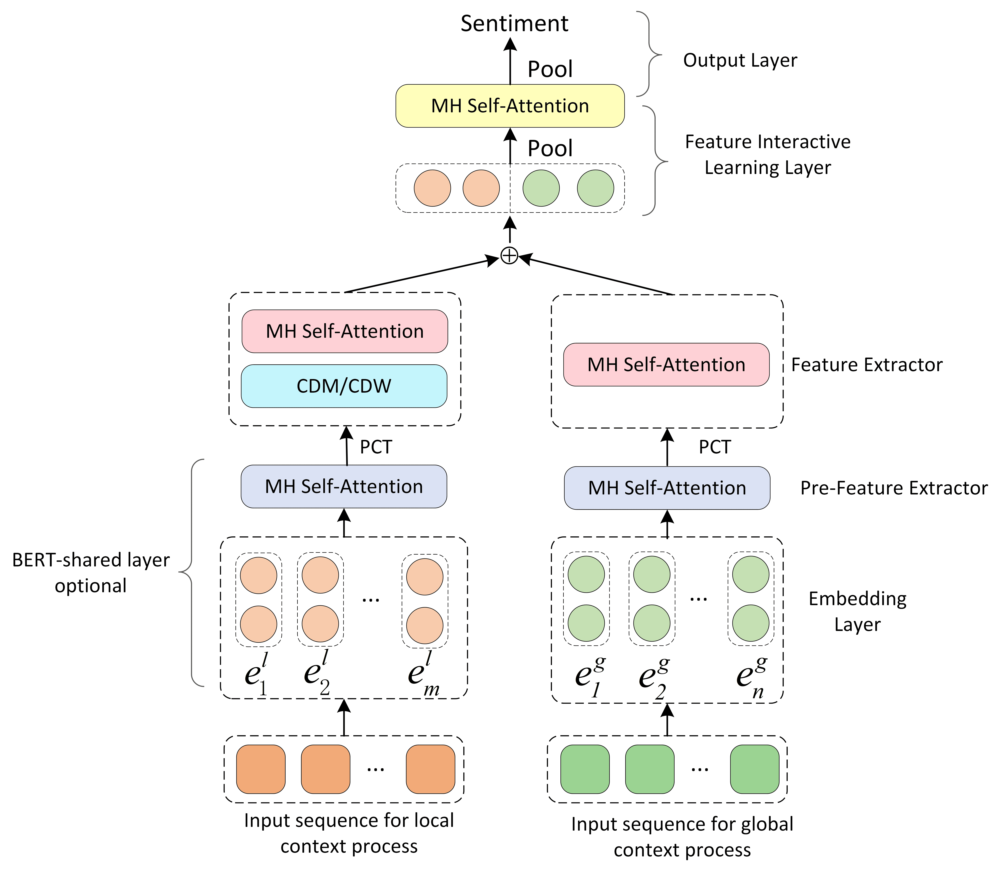

### AEN-BERT ([aen.py](./models/aen.py))
Song, Youwei, et al. "Attentional Encoder Network for Targeted Sentiment Classification." arXiv preprint arXiv:1902.09314 (2019). [[pdf]](https://arxiv.org/pdf/1902.09314.pdf)

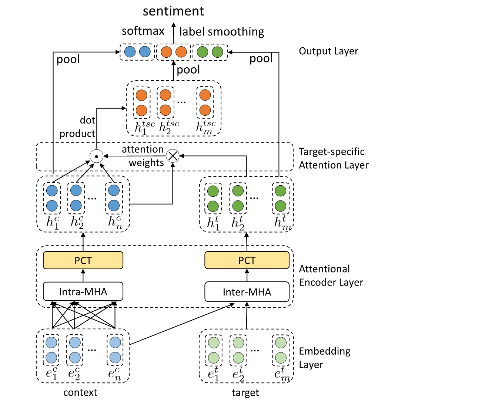

### BERT for Sentence Pair Classification ([bert_spc.py](./models/bert_spc.py))
Devlin, Jacob, et al. "Bert: Pre-training of deep bidirectional transformers for language understanding." arXiv preprint arXiv:1810.04805 (2018). [[pdf]](https://arxiv.org/pdf/1810.04805.pdf)

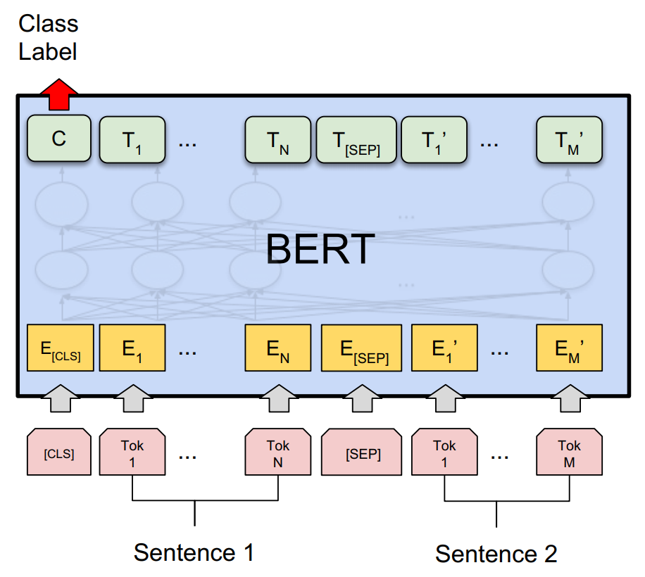